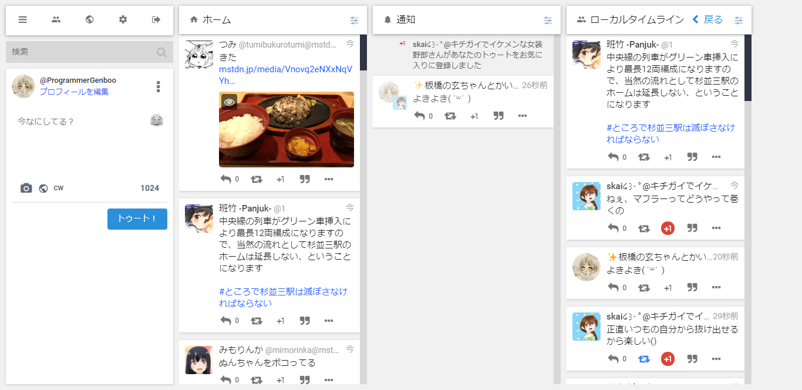

# Google+ Theme for Mastodon v1.0


## Languages
* [日本語 | Japanese](./README[Japanese].md)


## Overview
This theme replaces WebUI of any Mastodon instances with [Google+](https://plus.google.com) like one.


## Requirement
* [Mastodon](https://github.com/tootsuite/mastodon)
  * v2.6.x
  * v2.5.x
  * v2.4.x
* [Sass](https://sass-lang.com)


## Installation
1.  Follow [the official guide](https://github.com/tootsuite/documentation/blob/master/Running-Mastodon/Customizing.md#multiple-themes) and add this theme
    1.  Copy these files in `src` of this repository into `app/javascript/styles` of Mastodon source directory
        * `/gplus-theme-for-mastodon/`
        * `/gplus-theme-for-mastodon.scss`

    2.  Add the below code on `config/themes.yml`
        ```Yaml
        default: styles/application.scss
        contrast: styles/contrast.scss
        mastodon-light: styles/mastodon-light.scss
        # Maybe there are other themes...

        google-plus: styles/gplus-theme-for-mastodon.scss # Insert this one into any lines
        ```

    3.  Add localization data to `config/locales/{lang}.yml` (At least `config/locales/en.yml` is **REQUIRED**)
        ```Yaml
        themes:
          contrast: High contrast
          default: Mastodon
          mastodon-light: Mastodon (light)
          # Maybe there are other themes...

          gplus-theme-for-mastodon: Google+ # Insert this one into the below line
        ```

2.  To avoid *CSP(Content Security Policy)*, **MAKE SURE** to change `config/initializers/content_security_policy.rb` :
    ```Ruby
    base_host     = Rails.configuration.x.web_domain
    assets_host   = Rails.configuration.action_controller.asset_host
    assets_host ||= "http#{Rails.configuration.x.use_https ? 's' : ''}://#{base_host}"

    Rails.application.config.content_security_policy do |p|
    p.base_uri        :none
    p.default_src     :none
    p.frame_ancestors :none
    p.font_src        :self, assets_host, google_font_host
    p.img_src         :self, :https, :data, :blob, assets_host
    p.style_src       :self, :unsafe_inline, assets_host
    p.media_src       :self, :https, :data, assets_host
    p.frame_src       :self, :https
    p.manifest_src    :self, assets_host
    ```

    into
    ```Ruby
    base_host     = Rails.configuration.x.web_domain
    assets_host   = Rails.configuration.action_controller.asset_host
    assets_host ||= "http#{Rails.configuration.x.use_https ? 's' : ''}://#{base_host}"
    google_font_host = "https://fonts.gstatic.com"
    gplus_theme_host = "https://raw.githubusercontent.com"

    Rails.application.config.content_security_policy do |p|
    p.base_uri        :none
    p.default_src     :none
    p.frame_ancestors :none
    p.font_src        :self, assets_host, google_font_host, gplus_theme_host
    p.img_src         :self, :https, :data, :blob, assets_host, gplus_theme_host
    p.style_src       :self, :unsafe_inline, assets_host, gplus_theme_host
    p.media_src       :self, :https, :data, assets_host
    p.frame_src       :self, :https
    p.manifest_src    :self, assets_host
    ```


## Screenshots



