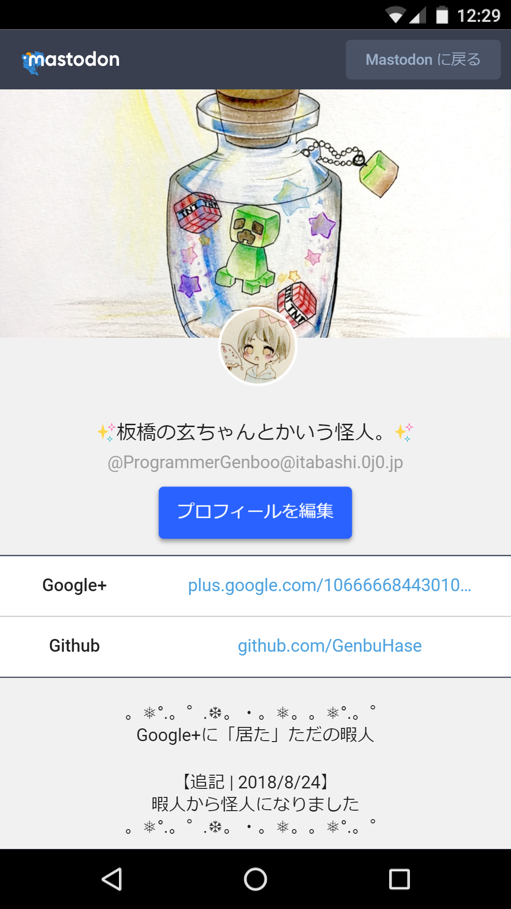

# Google+ Theme for Mastodon v1.0

## Languages
* [日本語 | Japanese](./README[Japanese].md)

## Overview
This theme replaces WebUI of any Mastodon instances with [Google+](https://plus.google.com) like one.

## Requirement
* [Mastodon](https://github.com/tootsuite/mastodon)
  * v2.6.x
  * v2.5.x
  * v2.4.x
* [Sass](https://sass-lang.com)

## Screenshots

