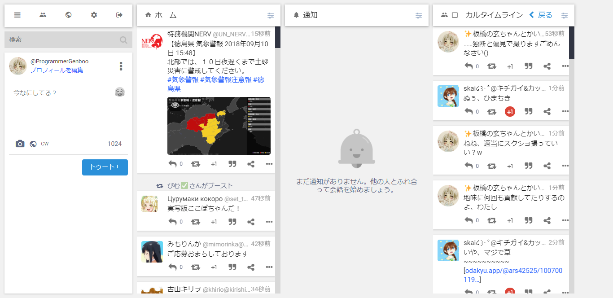
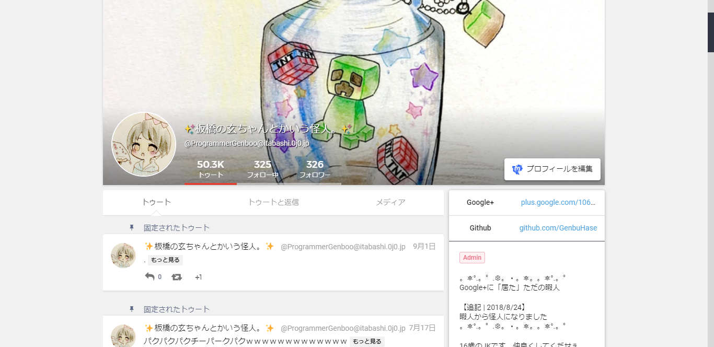
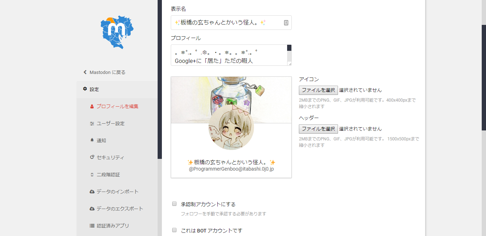
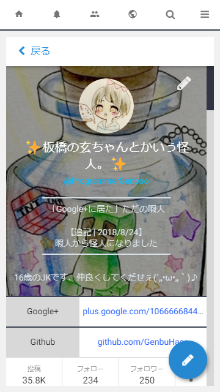

# Google+ Theme for Mastodon v1.0


## 言語 | Languages
* [English | 英語](./README.md)


## 概要 | Overview
MastodonインスタンスのWebUIを、[Google+](https://plus.google.com)風のUIに変更します。<Br />
スマホ表示にも対応しています。


## 動作環境 | Requirement
* [Mastodon](https://github.com/tootsuite/mastodon)
  * v2.6.x
  * v2.5.x
  * v2.4.x
* [Sass](https://sass-lang.com)


## 導入 | Install
このリポジトリの `src` 以下のファイルをmastodonの `app/javascript/styles` にコピーしてください。次に `config/themes.yml` に以下のコードを追記します。<br> `google-plus: styles/gplus-theme-for-mastodon.scss`  
CSP(content security policy)を回避するため、以下のように `config/initializers/content_security_policy.rb` を変更してください。  
前:
```
base_host     = Rails.configuration.x.web_domain
assets_host   = Rails.configuration.action_controller.asset_host
assets_host ||= "http#{Rails.configuration.x.use_https ? 's' : ''}://#{base_host}"

Rails.application.config.content_security_policy do |p|
  p.base_uri        :none
  p.default_src     :none
  p.frame_ancestors :none
  p.font_src        :self, assets_host
  p.img_src         :self, :https, :data, :blob, assets_host
  p.style_src       :self, :unsafe_inline, assets_host
  p.media_src       :self, :https, :data, assets_host
  p.frame_src       :self, :https
  p.manifest_src    :self, assets_host
```

後:
```
base_host     = Rails.configuration.x.web_domain
assets_host   = Rails.configuration.action_controller.asset_host
assets_host ||= "http#{Rails.configuration.x.use_https ? 's' : ''}://#{base_host}"
google_font_host = "https://fonts.gstatic.com"

Rails.application.config.content_security_policy do |p|
  p.base_uri        :none
  p.default_src     :none
  p.frame_ancestors :none
  p.font_src        :self, assets_host, google_font_host
  p.img_src         :self, :https, :data, :blob, assets_host
  p.style_src       :self, :unsafe_inline, assets_host
  p.media_src       :self, :https, :data, assets_host
  p.frame_src       :self, :https
  p.manifest_src    :self, assets_host
```

UI上でのテーマの表記を変更したい場合には `config/locales` 以下にある言語ファイルの themes セクションに表示させたい名前を追記してください。  
例)
```
themes:
  default: Mastodon
  google-plus: Google+
```

## スクリーンショット | Screenshots



